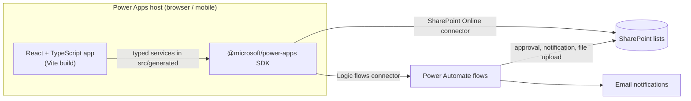

# Power Apps Workflow Suite

[](https://github.com/javanian/powerapps-code-app/actions/workflows/ci.yml)

Four business workflow applications built as **Microsoft Power Apps code apps** with React 19 and TypeScript. Each app is a typed frontend that runs inside the Power Apps host and works on SharePoint lists and Power Automate flows.

| Application | Workflow | Key capabilities |
| --- | --- | --- |
| [**5R Audit**](apps/5r-audit/) | Workplace 5R (5S) audits | Area-based audit scoring, compressed photo evidence, corrective-action follow-up with before/after images |
| [**TCCD Training Request**](apps/training-request/) | Training and certification requests | Request and participant entry, multi-step approval routing, admin portal, PIC assignment notifications |
| [**Vehicle Mileage**](apps/vehicle-mileage/) | Operational vehicle trips | Vehicle and driver selection, trip distance calculation and validation, report view |
| [**Unblock Material**](apps/unblock-material/) | Material unblock tickets | Ticket search, status filters, pagination, lazily loaded material details |

## Architecture



- **No custom backend.** Every app is a static frontend. Data access goes through the Power Apps SDK and connectors, so authentication, authorization and connection management are handled by the Power Platform rather than by custom code.
- **Typed data layer.** Connector models and services in `src/generated` are generated by the Power Apps CLI from the data-source descriptors. Application code wraps them in small domain modules (for example `followUpData.ts` and `kilometer-service.ts`) that handle mapping, validation and error messages.
- **Workflow logic in Power Automate.** Steps that need elevated permissions or out-of-band work (approval chains, notifications, binary uploads) run as flows that the apps call through the Logic flows connector.
- **Independent deployables.** Each app has its own manifest, lockfile and build so it can be versioned and published to its environment separately.

See [docs/architecture.md](docs/architecture.md) for the data flow of each application and the main design decisions.

## Engineering highlights

- **Image pipeline for low-bandwidth sites** (5R Audit): photos are validated, downscaled and re-encoded on the client before upload; previews are generated asynchronously so large photos are not decoded on the main thread.
- **Connector extensions** (5R Audit): registers additional SharePoint REST operations on top of the generated descriptor to write image-column values that the generated service does not expose.
- **Approval routing** (TCCD): admins compose ordered approver chains, start an approval flow and track each step's status, with client-side locks that prevent duplicate flow runs.
- **Mobile-friendly navigation** (5R Audit): an in-app view stack is synchronized with browser history so that the device back gesture moves between screens instead of closing the app.
- **Keyset pagination over large lists** (Unblock Material): tickets load in ID-ordered batches with OData filters, and related material rows are fetched in chunked `or` queries only when a ticket is opened.
- **CI quality gate**: GitHub Actions runs ESLint, the TypeScript compiler and the production build for all four apps on every pull request.

## Tech stack

| Area | Tools |
| --- | --- |
| Frontend | React 19, TypeScript 5.9, Vite 7 |
| Styling | Tailwind CSS (v3 and v4), shadcn/ui and Radix primitives, hand-written CSS |
| Data and state | Power Apps SDK, TanStack Query, React Router |
| Platform | Power Apps code apps, SharePoint Online, Power Automate, Power Apps CLI (`pac`) |
| Tooling | ESLint 9 with typescript-eslint and react-hooks, GitHub Actions |

## Repository structure

```text
.
├── apps/
│   ├── 5r-audit/            # Workplace audit and corrective-action follow-up
│   ├── training-request/    # TCCD training and certification requests
│   ├── vehicle-mileage/     # Vehicle mileage logging
│   └── unblock-material/    # Material unblock ticket tracking
├── docs/
│   └── architecture.md      # Per-app data flow and design decisions
├── scripts/
│   ├── setup-local.mjs      # Creates local config from tracked *.example files
│   └── run-all.mjs          # Runs an npm script in every app
└── .github/workflows/ci.yml # Lint, type-check and build matrix
```

Each app follows the same layout:

```text
apps/<app>/
├── config/dataSourcesInfo.example.ts  # Example connector descriptor for compilation
├── power.config.example.json          # Example Power Apps environment and connections
├── src/
│   ├── generated/                     # Power Apps CLI generated models and services
│   └── ...                            # Pages, components and domain modules
└── package.json
```

## Getting started

Requirements: Node.js 24 (see `.nvmrc`) and npm.

```bash
# Install, lint and build every app from the repository root
npm run install:all
npm run lint
npm run build

# Or work on a single app
cd apps/5r-audit
npm ci
npm run dev
```

`npm run dev` and `npm run build` first run `npm run setup`, which copies the tracked example configuration to the git-ignored locations the SDK expects (`power.config.json` and `.power/`). It never overwrites existing files.

The examples are enough to compile and inspect the apps. They do not include a SharePoint tenant, a mock backend or the Power Automate flow definitions, so live data operations need a configured Power Platform environment.

## Connecting to a Power Platform environment

1. Authenticate the Power Apps CLI: `pac auth create`.
2. Replace the example identifiers in `power.config.json` with your environment, connection, list and flow IDs.
3. Register the data sources with the CLI and regenerate `.power/` and `src/generated` using aliases compatible with the existing service classes.
4. Update the site constants in each app (for example `sharePointSiteUrl` in `apps/5r-audit/src/powerAppsClient.ts`).
5. Run `npm run dev` and open the app through the local play URL printed by the Power Apps Vite plugin.

App-specific requirements:

- **5R Audit:** audit and area-master lists, plus an upload flow that accepts `text` (file name) and `text_1` (image data URI) and returns `path`. Keep the extended descriptor registered in `src/powerAppsClient.ts` when regenerating connectors.
- **TCCD Training Request:** request, participant, member, division-head, personnel and approval lists, plus approval and notification flows. Employee lookup data is bundled into the frontend, so only use data that every app user may see. Convert an authorized workbook with `npm run convert:employee -- <path-to-xlsx>`.
- **Vehicle Mileage:** mileage, driver and vehicle lists.
- **Unblock Material:** ticket and material lists linked through `IDTICKET`. The example descriptor has no operations; generate a real one before querying. `scripts/add-sharepoint-data-sources.ps1` registers both lists after CLI authentication.

## Security notes

- Tenant identifiers, connection exports, operational data and internal notes are excluded through `.gitignore`. All IDs in the example files are placeholders.
- Role checks in the UI (for example the TCCD admin portal) only control what is displayed. SharePoint list permissions and flow permissions must enforce access.

## Scope and limitations

- Flow definitions and SharePoint list provisioning are not part of this repository.
- CI verifies linting, type-checking and production builds. It does not exercise live connectors, tenant permissions, approvals or uploads, and there are no automated UI tests yet.
- 5R Audit and Vehicle Mileage produce bundles larger than Vite's 500 kB warning threshold; code splitting is a known improvement.
- User-facing text is in Indonesian, matching the original users.

## Author

Built and maintained by [Javanian](https://github.com/javanian).
