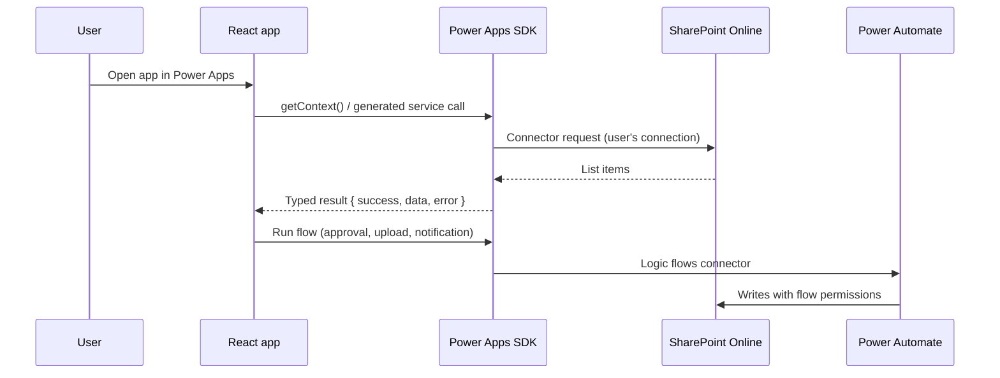

# Architecture

This document describes how the applications in this repository are structured and why. For setup instructions see the [root README](../README.md).

## Runtime model

All five applications are Power Apps **code apps**: static single-page applications built with Vite and published to a Power Platform environment. At runtime the Power Apps host loads the bundle, signs the user in and exposes connectors through the `@microsoft/power-apps` SDK.

Consequences of this model:

- There is no API server to deploy, secure or scale. Identity and connection consent are handled by the platform.
- Every connector call runs with the signed-in user's permissions. Client-side role checks only shape the UI, so SharePoint list permissions remain the source of truth.
- SDK calls return a result object instead of throwing on failure. Each app wraps calls with a timeout helper (`withPowerAppsTimeout`) and checks `success` explicitly before using `data`.

## Code organization

| Layer | Location | Responsibility |
| --- | --- | --- |
| Generated connectors | `src/generated/` | Models and services produced by the Power Apps CLI. Regenerated, not edited by hand. |
| Connector descriptor | `.power/` (local), `config/dataSourcesInfo.example.ts` (tracked) | Operation metadata the SDK uses to build requests. |
| Domain modules | e.g. `followUpData.ts`, `adminAccess.ts`, `services/kilometer-service.ts` | Query composition, field mapping, validation and readable error messages. |
| UI | Page and component modules | Rendering, local state and user interaction. |

Keeping domain modules between the generated services and the UI means a schema change usually touches one mapping module, not every screen.

## Applications

### 5R Audit (`apps/5r-audit`)

Flow: **Landing → Audit setup → Audit form → Follow-up list → Follow-up detail**

- `auditFormConfig.ts` maps each 5R criterion to its SharePoint columns, so the form is driven by configuration rather than hard-coded fields.
- `auditSetupData.ts` loads the area master once per session and caches the promise; a failed load clears the cache so the user can retry.
- `imagePrep.ts` validates file type and size, downscales photos and creates small preview images asynchronously.
- `evidenceImageColumn.ts` uploads evidence through a flow, then sets SharePoint image-column values through the connector's HTTP operation. `powerAppsClient.ts` registers those extra operations alongside the generated descriptor because the SDK caches the first descriptor it sees.
- `App.tsx` keeps an in-app view stack synchronized with `window.history`, so the browser or device back gesture navigates between screens and an exit confirmation guards the root.

### TCCD Training Request (`apps/training-request`)

Flow: **Request form → My requests → Admin portal**

- Requesters submit a training request with participants. Personnel numbers are resolved against a bundled employee lookup (`employeeLookup.ts`).
- `adminAccess.ts` resolves the current user's role (`ADMIN`, `SUPERADMIN`) from the member list to decide whether the admin portal is shown.
- The admin portal edits requests and participants, assigns a PIC (which triggers a notification flow), builds an ordered approver chain and starts the approval flow. A per-request lock prevents the same approval from being started twice while a run is in progress.
- Error toasts are raised where errors are reported (`useToastedError`), rather than by an effect watching error state.

### Vehicle Mileage (`apps/vehicle-mileage`)

Flow: **Home → Mileage entry and report**

- React Router handles navigation, with the basename normalized for the Power Apps host.
- TanStack Query caches vehicle, driver and mileage queries and invalidates them after a record is created or updated.
- UI components come from shadcn/ui on Radix primitives with Tailwind CSS v4 and a light/dark theme provider.

### Unblock Material (`apps/unblock-material`)

Flow: **Ticket list → Ticket detail**

- Tickets load in ID-ordered batches using keyset pagination (`ID lt <last id>`), which stays efficient on large SharePoint lists where offset paging does not.
- A lightweight material index (only the columns needed for counts) loads with the ticket list; full material rows are fetched in chunked OData `or` filters when a ticket is opened.
- User input in filters is escaped before it is placed in OData expressions.

### Overtime Request (`apps/overtime-request`)

Flow: **Pengajuan (supervisor) → Persetujuan (manager) → Rekap (HR)**

- `src/domain/overtime.ts` contains every business rule as pure functions: duration including shifts that cross midnight, the 4-hour daily and 18-hour weekly limits from PP 35/2021, Monday-based week grouping, the monthly recap and CSV export. `overtime.test.ts` covers them with Vitest and runs in CI.
- `src/data/overtimeRepository.ts` is the only module that talks to the Power Apps SDK. It maps SharePoint records to domain types and back, so the UI and the rules never see list column names.
- Employees on an SPL are stored as JSON in one column of the request instead of a child list: one write per SPL and a single query for the recap, at the cost of not filtering per employee on the server.
- The SPL number is derived from the list item ID (`SPL-<year>-<id>`), so it is unique without a separate counter list.
- Validation runs while the form is filled in: errors block submission, weekly-limit warnings are shown but do not block, because the manager makes that call.

## Configuration and secrets

- `power.config.json` and `.power/` hold environment-specific identifiers and are git-ignored. Tracked `*.example` files contain placeholders and are copied into place by `scripts/setup-local.mjs`.
- No credentials are stored in the repository. Connections are created and owned in the Power Platform environment.

## Continuous integration

`.github/workflows/ci.yml` runs a matrix job per application: `npm ci`, `npm run lint`, `npm run test` where an app defines it, then `npm run build` (TypeScript project build plus Vite production build). The build uses the example descriptors, so CI needs no tenant access.

## Known trade-offs

- **Separate lockfiles per app** keep deployments independent but duplicate dependency updates. npm workspaces would reduce duplication at the cost of coupling releases.
- **Bundled employee lookup** (TCCD) avoids a connector round-trip per lookup but ships the data to every client.
- **Unit tests cover domain rules only.** There are no automated UI tests; behavior against live connectors is verified manually in a Power Platform environment.
